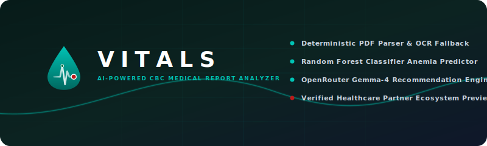
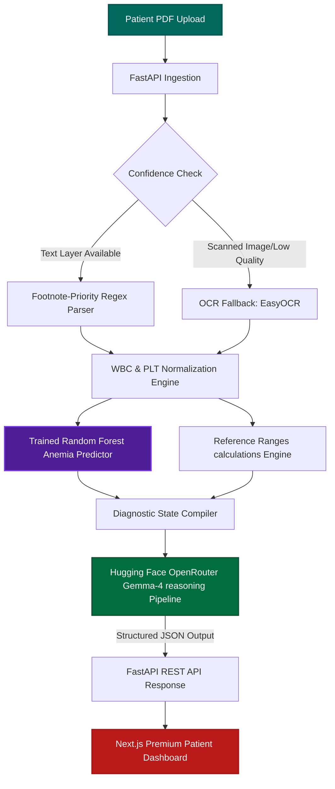
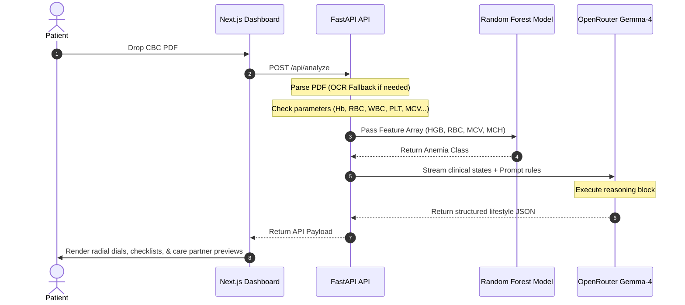
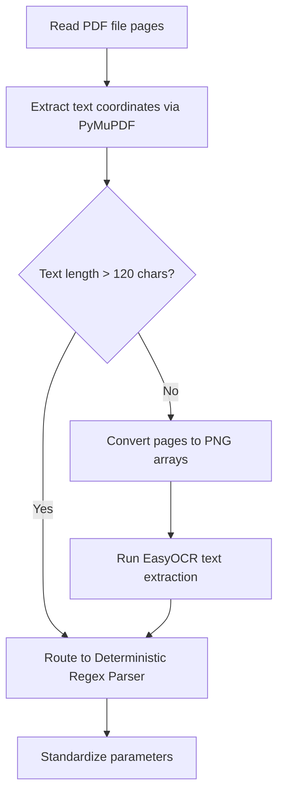

# Vitals: AI-Powered CBC Health Intelligence Platform

<p align="center">
  
</p>

<p align="center">
  
  
  
  
</p>

<p align="center">
  <strong>Vitals</strong> is an open-source, clinical-intelligence platform designed to bridge the diagnostic gap between laboratory blood reports and patients. By combining deterministic parsing, machine learning classifiers, and LLM reasoning models, Vitals translates isolated biomarker values into a structured, patient-centric wellness path.
</p>

---

## Table of Contents
1. [Overview](#overview)
2. [Problem Statement](#problem-statement)
3. [The Solution](#the-solution)
4. [Why Vitals is Different](#why-vitals-is-different)
5. [System Architecture & Workflow](#system-architecture--workflow)
6. [Core Features](#core-features)
7. [Technology Stack & Justification](#technology-stack--justification)
8. [Folder Structure](#folder-structure)
9. [Installation & Setup](#installation--setup)
10. [Configuration & Environment](#configuration--environment)
11. [Deployment Guide](#deployment-guide)
12. [Business Model & Strategy](#business-model--strategy)
13. [7-Phase Product Roadmap](#7-phase-product-roadmap)
14. [Contributing](#contributing)
15. [License & Acknowledgements](#license--acknowledgements)

---

## Overview

Every day, millions of blood draws are performed globally, culminating in a printed Complete Blood Count (CBC) report. These documents are saturated with dense clinical shorthand (e.g. MCV, MCH, RDW, PCV) and numerical values. For the average patient, these reports represent an opaque black box.

Vitals provides a patient-first interpreter. It deterministic-parses raw PDF data, falls back to OCR under poor resolution conditions, evaluates parameters via an ensemble Machine Learning model to detect underlying blood pathologies (e.g. specific anemia profiles), and triggers structured Large Language Model (LLM) reasoning loops to produce safe, non-diagnostic guidance regarding diets, hydration, physical fitness, and medical specialist referals.

---

## Problem Statement

The current healthcare system contains several friction points that Vitals is designed to address:
* **The Communication Gap:** Patients leave hospitals or clinics with physical or digital lab reports but zero immediate, understandable explanation of what the results mean.
* **Isolated Parameter Panics:** Typical reports display values next to reference intervals. Seeing a flagged parameter (e.g. low Hemoglobin) frequently leads patients to search generic search engines, resulting in high anxiety or false reassurance.
* **Clinician Burnout & Time Loss:** Up to 30% of standard clinical consultations are scheduled solely to explain routine lab reports that show normal or minor, non-critical variations. This consumes expensive clinical resources and physician hours.
* **Geographic Care Barriers:** Patients in rural regions or small towns often lack immediate, affordable access to hematologists or primary care physicians, causing them to delay necessary dietary or specialist follow-up.
* **Multi-biomarker Intersect Complexity:** Traditional reports check if individual markers are high or low, but fail to explain how markers interact. For example, understanding how a low hemoglobin count combined with low mean corpuscular volume (MCV) indicates microcytic anemia requires complex cross-referencing.

*Healthcare information should be understandable, actionable, and accessible to everyone.*

---

## The Solution

Vitals translates raw clinical diagnostic data into a patient-focused health narrative:

```
[CBC PDF Report] ──> [Deterministic OCR/Regex Parser] ──> [ML Classifier + Ranges Evaluation] ──> [Gemma LLM Reasoning Block] ──> [Structured Patient Care Path]
```

### Explaining the Workflow
1. **Patient Uploads CBC PDF:** Users drop digital or scanned reports into a secure portal.
2. **Deterministic & OCR Extraction:** Reconstructs the character grids, extracting numerical values.
   * *Why:* Solves manual typing errors and digitizes low-resolution paper scans.
3. **Machine Learning Pathology Classification:** Feeds the normalized hematological arrays into a trained Random Forest model.
   * *Why:* Programmatically flags underlying anemia variants (Normal, Iron Deficiency, Folate Deficiency, B12 Deficiency) based on clinical balances rather than isolated parameter limits.
4. **Calculations & reference checks:** Compiles scores based on clinical thresholds.
   * *Why:* Translates clinical metrics into a single, intuitive Physiological Health Score (0-100).
5. **AI Generative Reasoning Loop:** Routes the calculated state array through OpenRouter Gemma-4.
   * *Why:* Transforms raw clinical numbers into reassuring, conversational advice (nutrition, routines, fitness, hydration, and physician recommendations) conforming strictly to structured schemas.
6. **Ecosystem Registry Matching (Future Roadmap):** Recommends verified healthcare specialists and labs nearby.
   * *Why:* Prevents patients from blindly searching online and connects them directly with qualified, verified clinics.

---

## Why Vitals is Different

Vitals is **not** another Hospital Management System (HMS), booking portal, or open-ended medical chatbot. It is a dedicated **clinical intelligence bridge** representing a unified, multi-tier interpreter:

* **No Open-Ended Chats:** Unlike generic LLM chatbots that hallucinate medical conditions, Vitals uses a feed-forward architectural pipeline where the LLM only structures clinical calculations and predictions derived deterministically from the parser and ML models.
* **Unified Diagnostic Logic:** It is the only platform combining OCR, deterministic regex filters, scikit-learn classifiers, reference calculators, and LLM reasoning into a single light-themed, patient-friendly dashboard.

---

## System Architecture & Workflow

### 1. Overall System Architecture


### 2. Processing Pipeline Sequence


### 3. OCR Text Fallback Flow


---

## Core Features

### Current MVP Implementation
* **Digital PDF & Scanned OCR Ingestion:** Uses `PyMuPDF` text character extraction with direct fallback to `EasyOCR` for low-contrast scans.
* **Footnote Filtering:** Regex filters skip superscript footnote references (e.g. converting `Hematocrit 01 27.3%` safely to `27.3` instead of extracting `01`).
* **Machine Learning Classifier:** Scikit-learn Random Forest model predicting iron deficiency, folate deficiency, vitamin B12 deficiency, hemoglobin-specific anemia, or normal profiles.
* **Calculations Engine:** Computes physiological safety score (0-100), risk tier, abnormal finding tables, and clinical severity.
* **Gemma-4 reasoning Integration:** Connects to OpenRouter to parse states into formatted, markdown-compatible diet lists, fitness routines, and fluid goals.
* **Interactive Lifestyle Dashboard:** Features collapsible biomarker gauges, daily water tracking increments, routine checkbox timelines, and high-fidelity print layouts.
* **Care Partners Preview:** A disabled dashboard section featuring specialist referrals and verified preview partner clinics.

### Future Roadmap Vision
* **Location-Aware Referrals:** Requesting permission to locate nearby clinical specialists in our partner database.
* **Telemedicine booking integrations:** Scheduling appointments directly from the analysis dashboard.
* **Laboratory API Integrations:** Syncing raw values directly from diagnostic center databases, bypassing PDF uploads.

---

## Technology Stack & Justification

| Technology | Role | Justification |
| :--- | :--- | :--- |
| **Next.js 16 (App Router)** | UI Framework | Handles client-side state, print pre-rendering, and static page optimizations via Turbopack compilation. |
| **FastAPI** | REST API Backend | Selected for its asynchronous capabilities, fast request loops, and simple python-based integration with scientific calculations. |
| **Random Forest** | ML Classifier | Lightweight classification model that offers predictable, high-accuracy results on structured clinical diagnostics without large GPU dependencies. |
| **OpenRouter Gemma-4** | Generative reasoning | Harnesses state-of-the-art open-weights reasoning blocks to compile structured medical logic without safety filter blocks. |
| **Tailwind CSS** | Global Styling | Handles the typography, clinical color systems, responsive grids, and clean visual shadows. |
| **TypeScript** | Interface Contracts | Enforces compile-time type validation between FastAPI endpoints and frontend React components. |

---

## Folder Structure

```
Vitals/
├── api/                        # FastAPI Backend Application
│   ├── ai_provider.py          # OpenRouter completion clients & backoff retries
│   ├── classifier.py           # ML Model loading & feature matching
│   ├── parser.py               # PDF Regex extractors & OCR fallback
│   ├── index.py                # FastAPI endpoints & diagnostics
│   └── trained_model.joblib    # Trained Random Forest classifier weights
├── app/                        # Next.js App Router Frontend
│   ├── components/             # Reusable UI Components
│   │   ├── report/             # Biomarker cards & Lifestyle modules
│   │   │   └── care/           # "Continue Your Care" registry preview elements
│   │   └── shared/             # Loading timelines & Upload modals
│   ├── dashboard/              # Report results layout orchestrator
│   ├── lib/                    # API connection handlers
│   ├── types/                  # TypeScript interface contracts
│   └── globals.css             # Colors, shapes, & animations stylesheet
├── public/                     # Static SVGs, logos, & banners
├── render.yaml                 # Infrastructure configurations for Render
├── package.json                # Frontend package dependencies & scripts
├── requirements.txt            # Python backend dependencies
└── README.md                   # Repository documentation
```

---

## Installation & Setup

### Prerequisites
* Python 3.10+
* Node.js 18+
* An OpenRouter API Key

### 1. Clone the Repository
```bash
git clone https://github.com/Rohan-R07/Ai-medical-report-analyzer.git
cd Ai-medical-report-analyzer
```

### 2. Configure Environment Variables
Create a `.env` file in the root directory:
```env
OPENROUTER_API_KEY=your_openrouter_api_key_here
OPENROUTER_MODEL=google/gemma-4-26b-a4b-it
NEXT_PUBLIC_API_URL=http://127.0.0.1:8000
```

### 3. Backend Setup
Activate your virtual environment and install packages:
```bash
# Create venv
python -m venv venv
# Activate venv (Windows)
.\venv\Scripts\activate
# Activate venv (macOS/Linux)
source venv/bin/activate

# Install requirements
pip install -r requirements.txt
```

Launch the FastAPI backend server:
```bash
python api/index.py
```
The server will run on `http://127.0.0.1:8000`.

### 4. Frontend Setup
In a new terminal window, navigate to the root directory and install npm dependencies:
```bash
npm install
```

Start the Next.js development server:
```bash
npm run dev
```
Open `http://localhost:3000` in your web browser.

---

## Deployment Guide

Vitals is configured to deploy directly to **Render** using the provided `render.yaml` infrastructure blueprint:

1. Connect your GitHub repository to your Render Dashboard.
2. Render will automatically detect the `render.yaml` blueprint.
3. It will provision:
   * **Web Service (FastAPI):** Builds the Python backend using `requirements.txt`.
   * **Static Site (Next.js):** Builds the frontend static files using `npm run build`.
4. Add your `OPENROUTER_API_KEY` to the environment variables on the Render dashboard.

---

## Business Model & Strategy

Vitals operates under a patient-first healthcare ecosystem philosophy: **Patients should never pay simply to understand their own medical reports.**

### The MVP Model
* **100% Free:** Patients upload reports, receive predictions, and view summaries completely free.
* **No Advertisements:** To preserve patient trust and safety, no clinical pages show third-party ads.

### Long-Term Revenue Streams
The future sustainability of the platform relies on the **Verified Healthcare Partner Network**:
1. **Verified Partner Memberships:** Clinical centers, hospitals, and specialized practitioners pay a recurring membership fee to join the listing registry. In return, they get discoverability, verified clinical badges, and AI-powered referrals.
2. **Referral Commissions:** Partners pay small compliance-approved transaction commissions when patients utilize Vitals to book follow-up consultations.
3. **Premium Subscriptions:** Optional, paid patient subscription tiers containing biomarker history trend charts, AI family vaults, and continuous health monitoring.
4. **Diagnostic Laboratory Affiliate Integrations:** Partner labs pay referral fees to receive automated laboratory orders for follow-up blood count panels recommended in patient lifestyle summaries.

---

## 7-Phase Product Roadmap

```
Phase 1: CBC Analysis (MVP) 
  ↳ Core digital text PDF ingestion and footnote-aware regex parsing.
     ↓
Phase 2: Patient Dashboard (MVP)
  ↳ Interactive Radial Score, Biomarker track gauges, and offline detection.
     ↓
Phase 3: Personalized Wellness (MVP)
  ↳ Checkbox meal routines, physical exercises, and click-to-increment hydration counters.
     ↓
Phase 4: Verified Partner Network (Roadmap)
  ↳ Locked registration portal and credentials validation pipelines for partner clinics.
     ↓
Phase 5: Location-Aware Recommendations (Roadmap)
  ↳ Geographic matching systems connecting patients to verified clinics near their location.
     ↓
Phase 6: In-App Appointment Booking (Roadmap)
  ↳ Scheduling booking integrations with verified partner availability APIs.
     ↓
Phase 7: Long-Term Monitoring (Roadmap)
  ↳ Longitudinal historical trends tracking, family health vaults, and premium memberships.
```

---

## Screenshots

### 1. Onboarding & Upload Portal (The Dashboard)
The main hub page featuring Vitals' branding, connection status badges, feature cards, and the interactive document upload zone.


---

## Contributing

We welcome open-source contributions to enhance Vitals! To contribute:
1. Fork the repository.
2. Create a feature branch: `git checkout -b feature/amazing-feature`.
3. Commit your changes: `git commit -m "feat: add amazing-feature"`.
4. Push to the branch: `git push origin feature/amazing-feature`.
5. Open a Pull Request.

---

## License & Acknowledgements

* **License:** This project is licensed under the MIT License - see the [LICENSE](LICENSE) file for details.
* **Acknowledgements:**
  * The scikit-learn team for powerful model training and serializing frameworks.
  * PyMuPDF and EasyOCR for high-fidelity OCR fallbacks.
  * The Google DeepMind and OpenRouter teams for power-efficient LLM reasoning APIs.